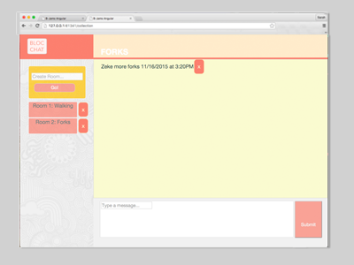
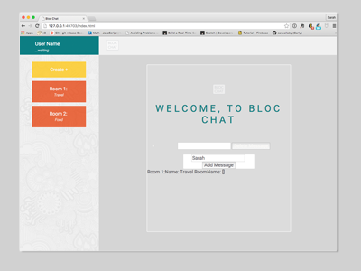

<h1>Bloc Chat</h1> 
<em>**Key tools used:** AngularJS, JavaScript, Firebase, Real Time Database, Sketch, HTML, and CSS</em>

<h2>Situation:</h2>
People’s biggest hang-up with airlines is poor communication. Bloc Chat wanted to create an outlet for people to communicate with flight staff, chat with other people on the plane who wanted to chat, and be notified about plane status from their own devices.

<h2>Code & Visuals: <a href="http://github.com/srhbinion/bloc-chat" style="font-size:.65em"><i class="fa fa-fw fa-github"></i></a></h2>
This site is built in **AngularJS**. A standout features of this site is that it is fully responsive and utilites real time database. It utilizes bootstrap to maintain the modals and [**Firebase**](https://www.firebase.com) facilitates the ability to store & sync data with the NoSQL cloud database. Data is stored as JSON, synced to all connected users in realtime, and available when the app goes offline. Too keep my code organized in my controllers and services I maintained object prototype naming standards. 

---

binChat.controller("LandingController", ["$scope", "$firebaseArray","Room", "Message", function($scope, $firebaseArray, Room, Message) {
    // "room" array features
    $scope.chatRooms = {
        // accesses "room" array
        room: Room.allRooms,
        // adds item to the "room" array
        add: function(room){
            // adds this info to new "room" item in array
            $scope.chatRooms.room.$add({
                name: $scope.newRoomName,
                type: "Room"
            });
            // ng-model hold room name information
            $scope.newRoomName =[];  
        },
        // removes item from "room" array
        remove: function(room){
            $scope.chatRooms.room.$remove(room); 
        },
        //shows the selected room as current room
        set: function(room){
            // toggles between rooms in bodypanel
            $scope.currentRoom = !$scope.currentRoom;
            // ability to call selected room name information
            $scope.current = {
                name: room.name,
                roomId: room.$id
        };
    }
};

<h6><i>excerpt code: modification to the "rooms" array in the database with prototype naming standards</i></h6>
---

Utilizing user scenarios and suggested by Bloc.io. Prototype comps were created in the browser and the final visual design comps were revised in Sketch and implemented in CSS by me.

---

<h6><i>prototype comps</i></h6>
---

<h2>Final Product:</h2>
Bloc Chat is a succinct app that gives users the power to be connected to their flights as soon as the crew knows.