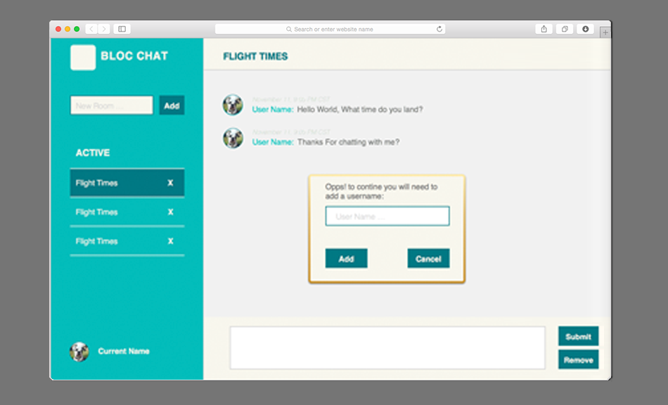

.

<h3>Code & Visuals: <a href="http://github.com/srhbinion/bloc-jams-angular" style="font-size:.65em"><i class="fa fa-fw fa-github"></i></a></h3>
This site is built originally in **JQuery** and vanilla **JavaScript** then I refactored it in **AngularJS**. A standout features of this site is that it is fully responsive and can play and display on any sized device. It utilizes bootstrap to maintain the grid system and [**JavaScript HTML5 Audio library**](http://buzz.jaysalvat.com/) facilitates the use of the best audio on any device and on any browser. 

---

setSong: function(album, song) {
    // current array/album
    this.currentAlbum = album;
    // current item/file "click"ed
    this.currentSoundFile = song;
    // activates html5 library
    this.currentSoundFile = new buzz.sound(song.audioUrl, {
        formats: ["mp3"],
        preload: true
    });
    // transitions and activates file
    this.currentSoundFile.play().fadeIn();
};

<h6><i>excerpt code: activation of buzz audio</i></h6>
---

Additionally, the music controller is stored in an **AngularJs** _factory_ so music will continue to play until a new song is selected or users leave the site.

---

bJams.factory("SongPlayer", function(albumService){
	// song status - default default state
    this.currentAlbum = null;
    this.currentSoundFile = null;
    };
  
    return {
        setSong: // action that cam be called outside of a controller (see above);
    }
});      

<h6><i>excerpt code: factory to music controls</i></h6>
---

Utilizing user scenarios and suggested CSS visuals were supplied by Bloc.io and refined by me.
