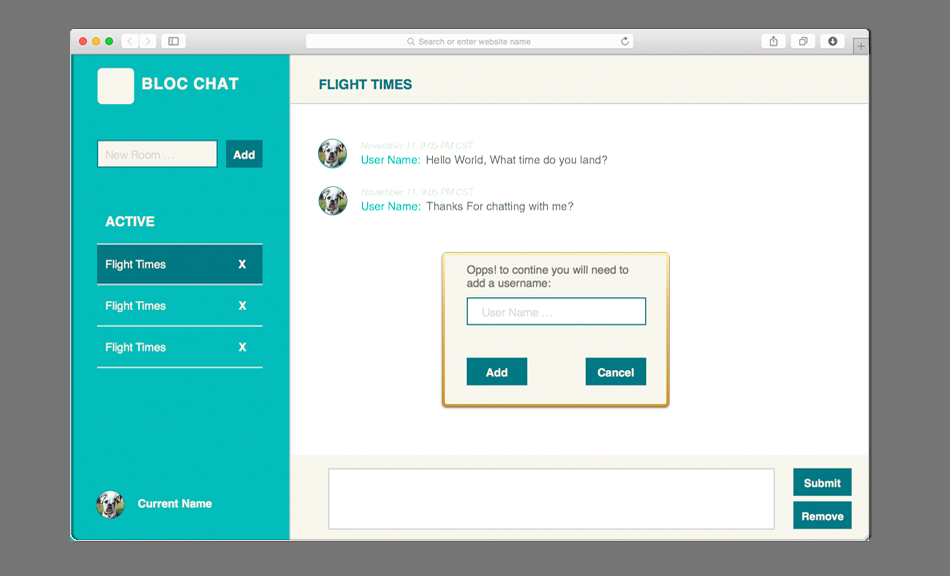

---

layout: post
title: Bloc Chat
thumbnail-path: "/img/thumb/BlocchatTb.png"

link-github: "https://github.com/srhbinion/bloc-chat"

link: "https://github.com/srhbinion/bloc-chat"
link-name: github.com/bloc-chat

keywords: Development, HTML/CSS, JQuery, JavaScript & Jekyll

description: |
    Bloc Chat is a site I created during my bloc.io boot camp using AngularJS to control the views and Firebase to hold the Real Time Chat data. Head over to github to see my code. 

---

---

### Sample Code
While writing my code, I learned the importance of informative documentation and prototype naming standards to keep my code succinct.

 

binChat.controller("LandingController", ["$scope", "$firebaseArray","Room", "Message", function($scope, $firebaseArray, Room, Message) {
    // "room" array features
    $scope.chatRooms = {
        // accesses "room" array
        room: Room.allRooms,
        // adds item to the "room" array
        add: function(room){
            // adds this info to new "room" item in array
            $scope.chatRooms.room.$add({
                name: $scope.newRoomName,
                type: "Room"
            });
            // ng-model hold room name information
            $scope.newRoomName =[];  
        },
        // removes item from "room" array
        remove: function(room){
            $scope.chatRooms.room.$remove(room); 
        },
        //shows the selected room as current room
        set: function(room){
            // toggles between rooms in bodypanel
            $scope.currentRoom = !$scope.currentRoom;
            // ability to call selected room name information
            $scope.current = {
                name: room.name,
                roomId: room.$id
        };
    }
};

 
 

---

### Early Prototyes
While designing this application, I refactored the visuals with different treatments and styles to practice my CSS.

---