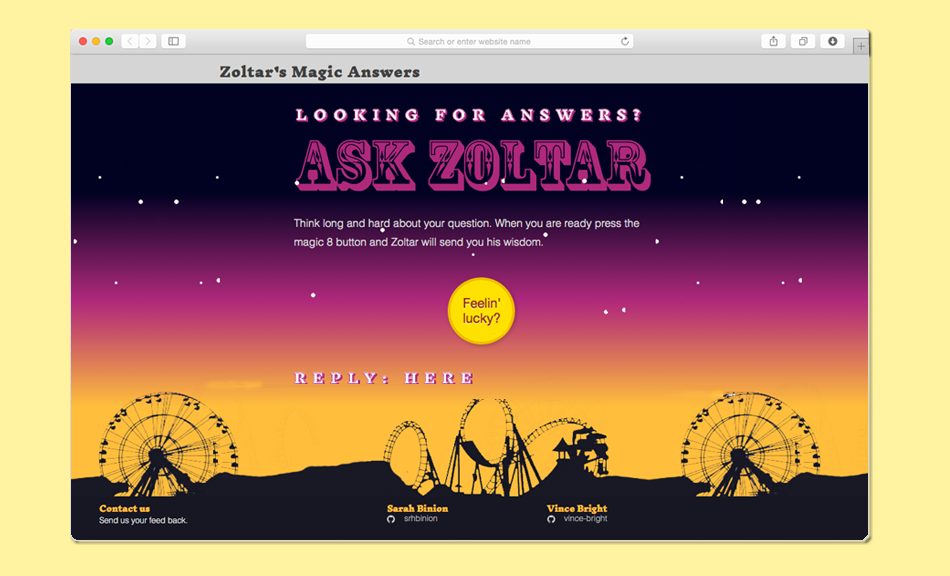

---

### Team Work

I partnered with a fellow junior developer to created this project during a self organized hackathon. Our goal was to practice working in an environment with multiple coders on the same project. I learned the importance of correctly documented commits and team communication.

---

