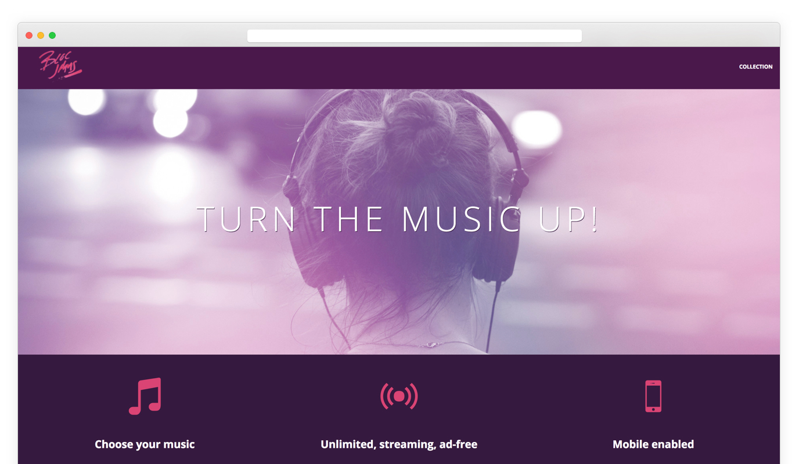
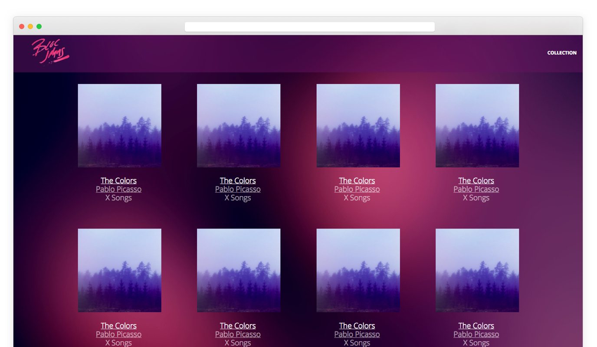
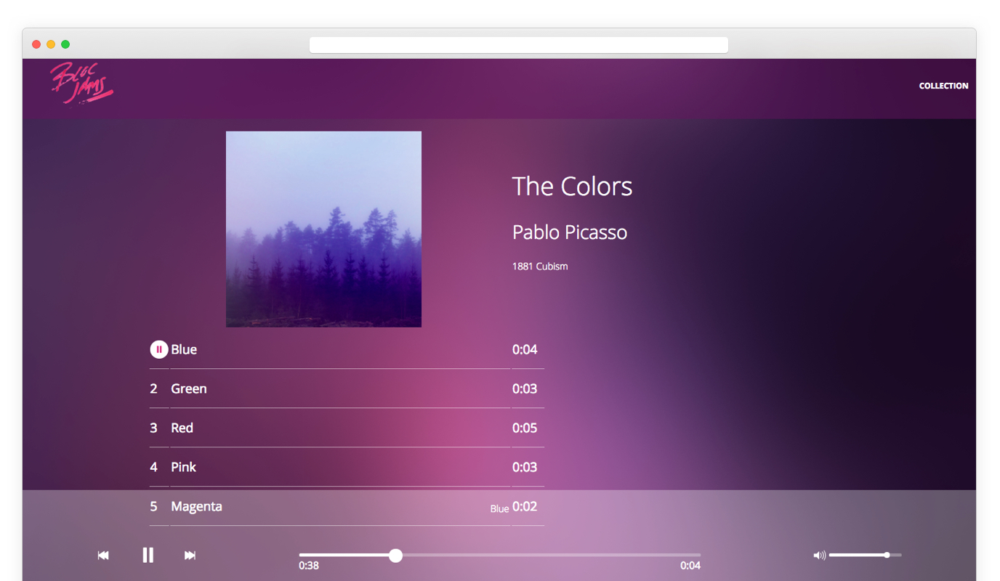

### Summary:

Bloc jams was a web based application that allowed for easy streaming and
Ad free listening. It is an alternative to a other streaming websites that hosts ads in-between songs for advertising dollars

---

### Explanation:

For this project I was tasked with bringing the design to life with HTML, CSS & Javascript. I used the javascript Buzz library to allow for the songs to be heard when a user would hit the play button.

---

### Problem:

Problems faced when building Bloc Jams we mainly around introducing JS to input all the albums and it’s content without writing HTML for every album. We used DOM scripting to input new data for every album.

---

### Solution:

Bloc jams is a website that allows users to stream songs from their favorite albums

---

### Result:

The result of Bloc Jams was a successful website where users could upload songs and stream as they please. The site was fully responsive and was cross browser tested to work on every modern day browser.  

